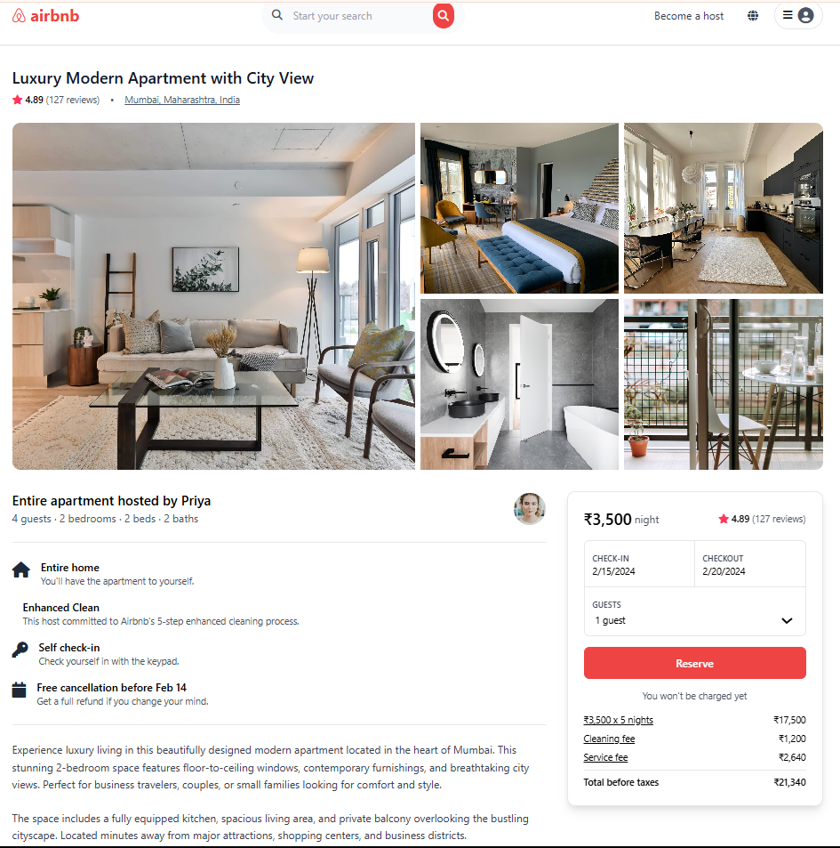

# 🏡 Airbnb Landing Page Clone — Tailwind CSS 🌟

Welcome to my **Airbnb landing page clone** built using **Tailwind CSS**!  
This is a fully responsive, modern one-page website inspired by Airbnb’s official design — made with clean HTML and styled entirely with Tailwind’s utility classes. ✨

---

## 🔍 Overview

✅ Built with **just one `index.html` file**  
✅ Styled using **Tailwind CSS via CDN**  
✅ Uses **online image URLs** for faster load and no asset management  
✅ Fully **responsive design** for desktop, tablet, and mobile  
✅ Includes **Google Maps embed**  
✅ Minimal, beautiful, and fast ⚡

---

## 🚀 Live Demo

> [Coming Soon... or open the `index.html` file directly in your browser to preview locally!](https://dinesh-uyyala.github.io/air-bnb-page-clone/)

---

## 📸 Screenshot

> 

---

## 🛠️ Tech Stack

- 🧱 **HTML5** – Clean semantic markup
- 🎨 **Tailwind CSS** – Loaded via CDN for rapid styling
- 🌍 **Google Maps Embed** – Location section integration
- 🌐 **Online image URLs** – Fast image loading without local files

---

## 📁 File Structure
air-bnb-page-clone/
├── index.html
└── README.md

That’s it! 🎉 No build tools, no assets folder, no dependencies. Simple and efficient.

---

## 🧪 How to Use

1. **Clone or download** this repository
2. **Open `index.html`** in any modern browser (Chrome, Firefox, Safari, etc.)
3. That’s it — enjoy the Airbnb experience clone!

---

## ✨ What You’ll See

- 👋 Logo, search bar, and nav
- 🖼️ Beautiful cards with real listings (images via URLs)
- 📍 Google Map embedded at the bottom
- 📱 Mobile-friendly layout with responsive design

---

## 💡 Customization Tips

Want to customize it?

- 🎨 Change colors or fonts directly in Tailwind classes
- 🖼️ Swap out image URLs for your own
- 🧩 Add more sections like testimonials, FAQs, or a footer
- 🌐 Deploy it to Netlify, Vercel, or GitHub Pages for free!

---

## 🙌 Acknowledgments

Inspired by the design of [Airbnb](https://www.airbnb.com/) — all images and branding are used for educational/demo purposes only.

---

## 📄 License

This project is licensed under the [MIT License](LICENSE).

---

## 🧑‍💻 Author

Made with ❤️ by Dinesh  
Connect with me: [GitHub](https://github.com/Dinesh-Uyyala) | [LinkedIn](https://www.linkedin.com/in/dinesh-uyyala-814679137/)

---

⭐️ If you liked this project, give it a star and share it with fellow developers!

